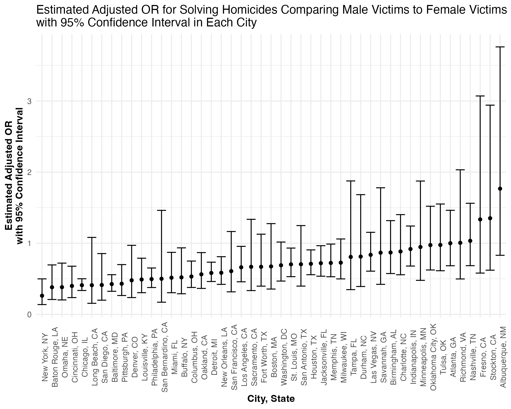

```{r setup, include = FALSE}
knitr::opts_chunk$set(
	echo = TRUE,
	message = FALSE,
	warning = FALSE,
	fig.height = 6,
	out.width = "90%",
	dpi = 200
)
```


```{r}
library(tidyverse)
library(labelled)
library(modelr)
```


```{r}
theme_set(theme_minimal() + theme(legend.position = "bottom"))
options(
  ggplot2.continuous.colour = "viridis",
  ggplot2.continuous.fill = "viridis"
)
scale_colour_discrete = scale_colour_viridis_d
scale_fill_discrete = scale_fill_viridis_d
```


## Problem 2

### Data Cleaning

Import the data.

```{r}
homicide = read_csv("data/homicide-data.csv")
```

Create a `city_state` variable and a `status` binary variable indicating whether the homicide is solved. Omit cities without victim race reported and those with data entry mistake.

```{r}
homicide = homicide %>% 
  mutate(
    state = str_to_upper(state),
    city_state = str_c(city, ", ", state),
    status = case_when(
      disposition == "Closed by arrest"      ~ "resolved",
      disposition == "Closed without arrest" ~ "unresolved",
      disposition == "Open/No arrest"        ~ "unresolved",
      TRUE                                   ~ ""
    )
  ) %>% 
  filter(!(city_state %in% c("Dallas, TX", "Phoenix, AZ", "Kansas City, MO", "Tulsa, AL")))
```

Limit the analysis to those whom `victim_race` is `white` or `black`. Change `victim_age` into numeric.

```{r}
homicide_sub = homicide %>% 
  filter(victim_race %in% c("Black", "White")) %>% 
  mutate(victim_age = as.numeric(victim_age))
```

### Logistic Regression for Baltimore, MD

```{r}
fit = 
  homicide_sub %>% 
  filter(city_state == "Baltimore, MD") %>% 
  mutate(
    status = fct_relevel(status, "unresolved")
  ) %>% 
  glm(status ~ victim_age + victim_sex + victim_race, data = ., family = "binomial")
```

Use `broom::tidy()` to extract the results of logistic regression. To get the estimate and confidence interval of the adjusted **odds ratio**, we need to exponentiate the coefficient and the confidence interval.

```{r}
fit %>% 
  broom::tidy() %>% 
  mutate(
    OR = exp(estimate),
    lower_bound = exp(estimate - 1.96 * std.error),
    upper_bound = exp(estimate + 1.96 * std.error)
  ) %>% 
  select(term, log_OR = estimate, OR, lower_bound, upper_bound) %>%
  knitr::kable(
    digits = 3,
    col.names = c("Term", "log(OR)", "Odds Ratio", "95% Lower", "95% Upper")    
  )
```

The adjusted odds ratio for solving homicides comparing male victims to female victims is 0.426, with a 95% confidence interval of (0.325, 0.558), keeping all other variables fixed.

### Logistic Regression on Each City

Run `glm` for each of the cities in the dataset and extract the adjusted odds ratio and CI for solving homicides comparing male victims to female victims by `map()`.

```{r}
homicide_nest = homicide_sub %>% 
  mutate(
    status = fct_relevel(status, "unresolved")
  ) %>% 
  nest(df = -city_state)

fit = homicide_nest %>% 
  mutate(
    models = map(.x = df, ~ glm(status ~ victim_age + victim_sex + victim_race, data = .x, family = "binomial")),
    results = map(models, broom::tidy)
  ) %>% 
  select(city_state, results) %>% 
  unnest(results) %>% 
  mutate(
    OR = exp(estimate),
    lower_bound = exp(estimate - 1.96 * std.error),
    upper_bound = exp(estimate + 1.96 * std.error)
  ) %>% 
  filter(term == "victim_sexMale") %>% 
  select(city_state, log_OR = estimate, OR, lower_bound, upper_bound)

fit %>% 
  knitr::kable(
    digits = 3,
    col.names = c("City, State", "log(OR)", "Odds Ratio", "95% Lower", "95% Upper")  
  )
```

Make a plot showing the estimated ORs and CIs for each city.

```{r}
estimate_ci_plot = fit %>% 
  mutate(
    city_state = fct_reorder(city_state, OR)
  ) %>% 
  ggplot(aes(x = city_state, y = OR)) +
  geom_point() +
  geom_errorbar(aes(ymin = lower_bound, ymax = upper_bound)) +
  labs(
    x = "City, State",
    y = "Estimated Adjusted OR\nwith 95% Confidence Interval",
    title = "Estimated Adjusted OR for Solving Homicides Comparing Male Victims to Female Victims\nwith 95% Confidence Interval in Each City"
  ) +
  theme(
    axis.text.x = element_text(angle = 90),
    axis.title = element_text(face = "bold")
  )

ggsave(
  estimate_ci_plot,
  filename = "results/estimate_plot.png",
  width = 20,
  height = 16,
  units = "cm",
  bg = "white"
)


```

Among the `r nrow(homicide_nest)` cities in the dataset, New York, NY has the lowest estimated OR for solving homicide comparing male victims to female victims while keeping all other variables fixed, while Albuquerque, NM, has the highest, though with a much wider confidence interval compared to New York, NY, indicating less precision in the estimated OR for Albuquerque, NM, than that of New York, NY.


## Problem 3

### Data Cleaning

Import the data.

```{r}
birthweight = read_csv("data/birthweight.csv")
```

Label `babysex`, `frace`, `malform`, and `mrace`. Convert the labelled variables into factor.

```{r}
birthweight = birthweight %>% 
  set_value_labels(
    babysex = c("male" = 1, "female" = 2),
    frace = c("White" = 1, "Black" = 2, "Asian" = 3, "Puerto Rican" = 4, "Other" = 8, "Unknown" = 9),
    malform = c("absent" = 0, "present" = 1),
    mrace = c("White" = 1, "Black" = 2, "Asian" = 3, "Puerto Rican" = 4, "Other" = 8)
  ) %>% 
  mutate_if(is.labelled, to_factor)
```

Use `skimr::skim()` to check for missing values (results hidden in the knitted file).

```{r, results = 'hide'}
skimr::skim(birthweight)
```

Number of missing for each variable equals to 0 - no missing data in the current dataset.

The tidied dataset contains observations on `r nrow(birthweight)` children. The data include `r ncol(birthweight)` variables that might have influence on a child's birth weight. These variables are primarily body measurement of baby and mother (such as, baby's head circumference at birth, baby's length, baby's  birth weight, mother's weight at delivery, etc.), in addition to some demographic information of both babies and the index parents (such as, sex of child, race of parent, etc.).

### Fit a Linear Regression Model

Based on former knowledge, genetics, age of the parent, length of pregnancy, mother's habits, socioeconomic status and demographic of index parents might have influences on birth weight of a baby. Related to the variables which are in the dataset, I hypothesized that family monthly income (`fincome`), gestational age in weeks (`gaweeks`), mother’s age at delivery (`momage`), number of live births prior to this pregnancy (`parity`), mother’s pre-pregnancy BMI (`ppbmi`), and average number of cigarettes smoked per day during pregnancy (`smoken`) as some predictors in the model estimating birth weight.

```{r}
linear_model = lm(bwt ~ fincome + gaweeks + momage + parity + ppbmi + smoken, data = birthweight)

linear_model %>% 
  broom::tidy() %>% 
  select(term, estimate, p.value) %>% 
  knitr::kable(
    digits = 3,
    col.names = c("Term", "Estimate", "P-value")
  )
```

Show a plot of model residuals against fitted values.

```{r}
birthweight %>% 
  add_predictions(linear_model) %>% 
  add_residuals(linear_model) %>% 
  ggplot(aes(x = pred, y = resid, color = resid)) +
  geom_point(alpha = .3) +
  labs(
    x = "Fitted Values of Birth Weight",
    y = "Residuals",
    title = "Model Residuals vs Fitted Values of Birth Weight"
  )
```

