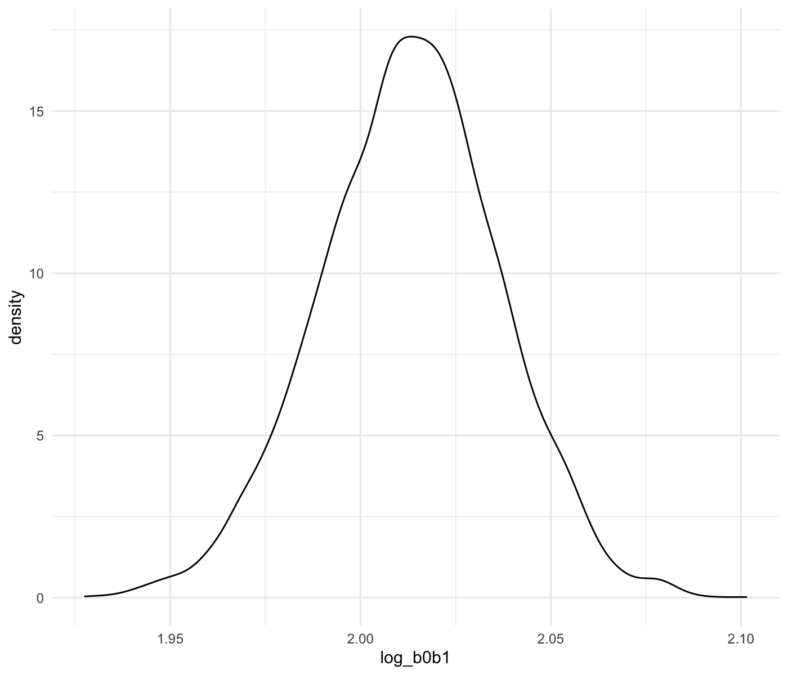
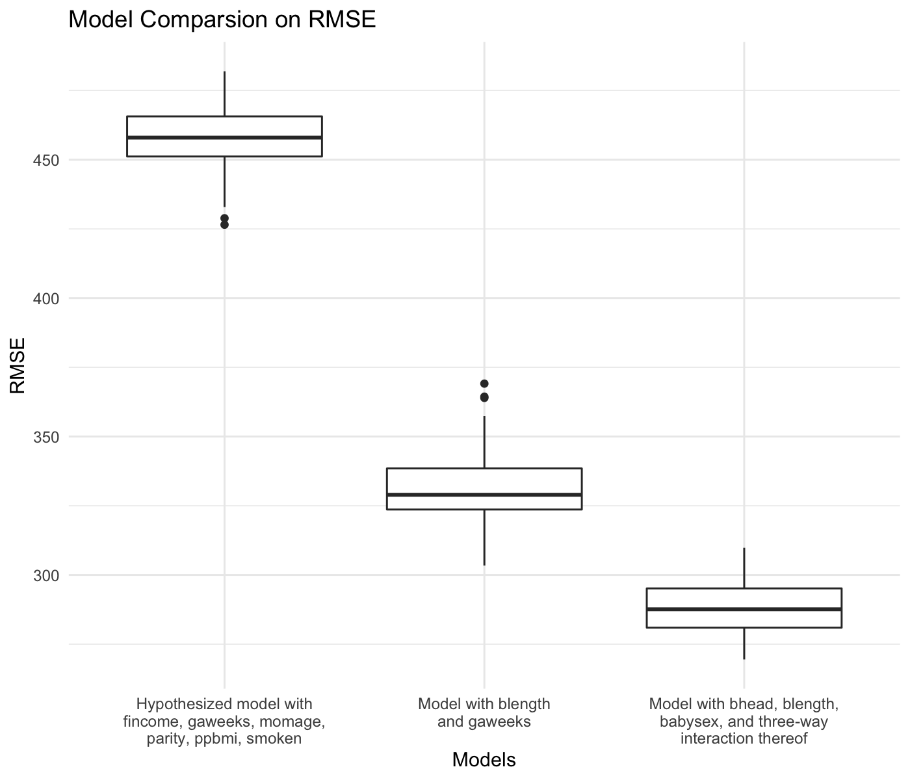

P8105 Homework 6
================
Siyue Gao
2022-12-03

``` r
library(tidyverse)
library(labelled)
library(modelr)
```

``` r
theme_set(theme_minimal() + theme(legend.position = "bottom"))
options(
  ggplot2.continuous.colour = "viridis",
  ggplot2.continuous.fill = "viridis"
)
scale_colour_discrete = scale_colour_viridis_d
scale_fill_discrete = scale_fill_viridis_d
```

## Problem 1

To obtain a distribution for $\hat{r}^2$, we’ll follow basically the
same procedure we used for regression coefficients: draw bootstrap
samples; the a model to each; extract the value I’m concerned with; and
summarize. Here, we’ll use `modelr::bootstrap` to draw the samples and
`broom::glance` to produce `r.squared` values.

``` r
weather_df = 
  rnoaa::meteo_pull_monitors(
    c("USW00094728"),
    var = c("PRCP", "TMIN", "TMAX"), 
    date_min = "2017-01-01",
    date_max = "2017-12-31"
  ) %>%
  mutate(
    name = recode(id, USW00094728 = "CentralPark_NY"),
    tmin = tmin / 10,
    tmax = tmax / 10
  ) %>%
  select(name, id, everything())
```

``` r
weather_df %>% 
  bootstrap(n = 5000) %>% 
  mutate(
    models = map(strap, ~lm(tmax ~ tmin, data = .x) ),
    results = map(models, broom::glance)
  ) %>% 
  select(-strap, -models) %>% 
  unnest(results) %>% 
  ggplot(aes(x = r.squared)) + 
  geom_density()
```


In this example, the $\hat{r}^2$ value is high, and the upper bound at 1
may be a cause for the generally skewed shape of the distribution. If we
wanted to construct a confidence interval for $R^2$, we could take the
2.5% and 97.5% quantiles of the estimates across bootstrap samples.
However, because the shape isn’t symmetric, using the mean +/- 1.96
times the standard error probably wouldn’t work well.

We can produce a distribution for $\log(\hat\beta_0 * \hat\beta1)$ using
a similar approach, with a bit more wrangling before we make our plot.

``` r
weather_df %>% 
  modelr::bootstrap(n = 5000) %>% 
  mutate(
    models = map(strap, ~lm(tmax ~ tmin, data = .x) ),
    results = map(models, broom::tidy)
  ) %>% 
  select(-strap, -models) %>% 
  unnest(results) %>% 
  select(id = `.id`, term, estimate) %>% 
  pivot_wider(
    names_from = term, 
    values_from = estimate
  ) %>% 
  rename(beta0 = `(Intercept)`, beta1 = tmin) %>% 
  mutate(log_b0b1 = log(beta0 * beta1)) %>% 
  ggplot(aes(x = log_b0b1)) + 
  geom_density()
```



As with $r^2$, this distribution is somewhat skewed and has some
outliers.

The point of this is not to say you should always use the bootstrap –
it’s possible to establish “large sample” distributions for strange
parameters / values / summaries in a lot of cases, and those are great
to have. But it is helpful to know that there’s a way to do inference
even in tough cases.

The 95% confidence interval for $\hat{r}^2$ is:

``` r
weather_df %>% 
  bootstrap(n = 5000) %>% 
  mutate(
    models = map(strap, ~lm(tmax ~ tmin, data = .x) ),
    results = map(models, broom::glance)
  ) %>% 
  select(-strap, -models) %>% 
  unnest(results) %>% 
  summarise(
    lower_bound = quantile(r.squared, 0.025),
    upper_bound = quantile(r.squared, 0.975)
  ) %>% 
  knitr::kable(
    digits = 3,
    col.names = c("95% CI Lower", "95% CI Upper")
  )
```

| 95% CI Lower | 95% CI Upper |
|-------------:|-------------:|
|        0.894 |        0.927 |

The 95% confidence interval for $\log(\hat\beta_0 * \hat\beta1)$ is:

``` r
weather_df %>% 
  modelr::bootstrap(n = 5000) %>% 
  mutate(
    models = map(strap, ~lm(tmax ~ tmin, data = .x) ),
    results = map(models, broom::tidy)
  ) %>% 
  select(-strap, -models) %>% 
  unnest(results) %>% 
  select(id = `.id`, term, estimate) %>% 
  pivot_wider(
    names_from = term, 
    values_from = estimate
  ) %>% 
  rename(beta0 = `(Intercept)`, beta1 = tmin) %>% 
  mutate(log_b0b1 = log(beta0 * beta1)) %>% 
  summarise(
    lower_bound = quantile(log_b0b1, 0.025),
    upper_bound = quantile(log_b0b1, 0.975)
  ) %>% 
  knitr::kable(
    digits = 3,
    col.names = c("95% CI Lower", "95% CI Upper")
  )
```

| 95% CI Lower | 95% CI Upper |
|-------------:|-------------:|
|        1.966 |        2.058 |

## Problem 2

### Data Cleaning

Import the data.

``` r
homicide = read_csv("data/homicide-data.csv")
```

Create a `city_state` variable and a `status` binary variable indicating
whether the homicide is solved. Omit cities without victim race reported
and those with data entry mistake.

``` r
homicide = homicide %>% 
  mutate(
    state = str_to_upper(state),
    city_state = str_c(city, ", ", state),
    status = case_when(
      disposition == "Closed by arrest"      ~ "resolved",
      disposition == "Closed without arrest" ~ "unresolved",
      disposition == "Open/No arrest"        ~ "unresolved",
      TRUE                                   ~ ""
    )
  ) %>% 
  filter(!(city_state %in% c("Dallas, TX", "Phoenix, AZ", "Kansas City, MO", "Tulsa, AL")))
```

Limit the analysis to those whom `victim_race` is `white` or `black`.
Change `victim_age` into numeric.

``` r
homicide_sub = homicide %>% 
  filter(victim_race %in% c("Black", "White")) %>% 
  mutate(victim_age = as.numeric(victim_age))
```

### Logistic Regression for Baltimore, MD

``` r
fit = 
  homicide_sub %>% 
  filter(city_state == "Baltimore, MD") %>% 
  mutate(
    status = fct_relevel(status, "unresolved")
  ) %>% 
  glm(status ~ victim_age + victim_sex + victim_race, data = ., family = "binomial")
```

Use `broom::tidy()` to extract the results of logistic regression. To
get the estimate and confidence interval of the adjusted **odds ratio**,
we need to exponentiate the coefficient and the confidence interval.

``` r
fit %>% 
  broom::tidy() %>% 
  mutate(
    OR = exp(estimate),
    lower_bound = exp(estimate - 1.96 * std.error),
    upper_bound = exp(estimate + 1.96 * std.error)
  ) %>% 
  select(term, log_OR = estimate, OR, lower_bound, upper_bound) %>%
  knitr::kable(
    digits = 3,
    col.names = c("Term", "log(OR)", "Odds Ratio", "95% Lower", "95% Upper")    
  )
```

| Term             | log(OR) | Odds Ratio | 95% Lower | 95% Upper |
|:-----------------|--------:|-----------:|----------:|----------:|
| (Intercept)      |   0.310 |      1.363 |     0.975 |     1.907 |
| victim_age       |  -0.007 |      0.993 |     0.987 |     1.000 |
| victim_sexMale   |  -0.854 |      0.426 |     0.325 |     0.558 |
| victim_raceWhite |   0.842 |      2.320 |     1.648 |     3.268 |

The adjusted odds ratio for solving homicides comparing male victims to
female victims is 0.426, with a 95% confidence interval of (0.325,
0.558), keeping all other variables fixed.

### Logistic Regression on Each City

Run `glm` for each of the cities in the dataset and extract the adjusted
odds ratio and CI for solving homicides comparing male victims to female
victims by `map()`.

``` r
homicide_nest = homicide_sub %>% 
  mutate(
    status = fct_relevel(status, "unresolved")
  ) %>% 
  nest(df = -city_state)

fit = homicide_nest %>% 
  mutate(
    models = map(.x = df, ~ glm(status ~ victim_age + victim_sex + victim_race, data = .x, family = "binomial")),
    results = map(models, broom::tidy)
  ) %>% 
  select(city_state, results) %>% 
  unnest(results) %>% 
  mutate(
    OR = exp(estimate),
    lower_bound = exp(estimate - 1.96 * std.error),
    upper_bound = exp(estimate + 1.96 * std.error)
  ) %>% 
  filter(term == "victim_sexMale") %>% 
  select(city_state, log_OR = estimate, OR, lower_bound, upper_bound)

fit %>% 
  knitr::kable(
    digits = 3,
    col.names = c("City, State", "log(OR)", "Odds Ratio", "95% Lower", "95% Upper")  
  )
```

| City, State        | log(OR) | Odds Ratio | 95% Lower | 95% Upper |
|:-------------------|--------:|-----------:|----------:|----------:|
| Albuquerque, NM    |   0.570 |      1.767 |     0.831 |     3.761 |
| Atlanta, GA        |   0.000 |      1.000 |     0.684 |     1.463 |
| Baltimore, MD      |  -0.854 |      0.426 |     0.325 |     0.558 |
| Baton Rouge, LA    |  -0.964 |      0.381 |     0.209 |     0.695 |
| Birmingham, AL     |  -0.139 |      0.870 |     0.574 |     1.318 |
| Boston, MA         |  -0.395 |      0.674 |     0.356 |     1.276 |
| Buffalo, NY        |  -0.653 |      0.521 |     0.290 |     0.935 |
| Charlotte, NC      |  -0.123 |      0.884 |     0.557 |     1.403 |
| Chicago, IL        |  -0.891 |      0.410 |     0.336 |     0.501 |
| Cincinnati, OH     |  -0.917 |      0.400 |     0.236 |     0.677 |
| Columbus, OH       |  -0.630 |      0.532 |     0.378 |     0.750 |
| Denver, CO         |  -0.736 |      0.479 |     0.236 |     0.971 |
| Detroit, MI        |  -0.541 |      0.582 |     0.462 |     0.734 |
| Durham, NC         |  -0.208 |      0.812 |     0.392 |     1.683 |
| Fort Worth, TX     |  -0.402 |      0.669 |     0.397 |     1.127 |
| Fresno, CA         |   0.289 |      1.335 |     0.580 |     3.071 |
| Houston, TX        |  -0.341 |      0.711 |     0.558 |     0.907 |
| Indianapolis, IN   |  -0.085 |      0.919 |     0.679 |     1.242 |
| Jacksonville, FL   |  -0.329 |      0.720 |     0.537 |     0.966 |
| Las Vegas, NV      |  -0.178 |      0.837 |     0.608 |     1.154 |
| Long Beach, CA     |  -0.891 |      0.410 |     0.156 |     1.082 |
| Los Angeles, CA    |  -0.413 |      0.662 |     0.458 |     0.956 |
| Louisville, KY     |  -0.712 |      0.491 |     0.305 |     0.790 |
| Memphis, TN        |  -0.324 |      0.723 |     0.529 |     0.988 |
| Miami, FL          |  -0.663 |      0.515 |     0.304 |     0.872 |
| Milwaukee, WI      |  -0.319 |      0.727 |     0.499 |     1.060 |
| Minneapolis, MN    |  -0.054 |      0.947 |     0.478 |     1.875 |
| Nashville, TN      |   0.034 |      1.034 |     0.685 |     1.562 |
| New Orleans, LA    |  -0.536 |      0.585 |     0.422 |     0.811 |
| New York, NY       |  -1.338 |      0.262 |     0.138 |     0.499 |
| Oakland, CA        |  -0.574 |      0.563 |     0.365 |     0.868 |
| Oklahoma City, OK  |  -0.026 |      0.974 |     0.624 |     1.520 |
| Omaha, NE          |  -0.961 |      0.382 |     0.203 |     0.721 |
| Philadelphia, PA   |  -0.701 |      0.496 |     0.378 |     0.652 |
| Pittsburgh, PA     |  -0.842 |      0.431 |     0.265 |     0.700 |
| Richmond, VA       |   0.006 |      1.006 |     0.498 |     2.033 |
| San Antonio, TX    |  -0.350 |      0.705 |     0.398 |     1.249 |
| Sacramento, CA     |  -0.402 |      0.669 |     0.335 |     1.337 |
| Savannah, GA       |  -0.143 |      0.867 |     0.422 |     1.780 |
| San Bernardino, CA |  -0.692 |      0.500 |     0.171 |     1.462 |
| San Diego, CA      |  -0.884 |      0.413 |     0.200 |     0.855 |
| San Francisco, CA  |  -0.498 |      0.608 |     0.317 |     1.165 |
| St. Louis, MO      |  -0.352 |      0.703 |     0.530 |     0.932 |
| Stockton, CA       |   0.301 |      1.352 |     0.621 |     2.942 |
| Tampa, FL          |  -0.214 |      0.808 |     0.348 |     1.876 |
| Tulsa, OK          |  -0.025 |      0.976 |     0.614 |     1.552 |
| Washington, DC     |  -0.371 |      0.690 |     0.468 |     1.017 |

Make a plot showing the estimated ORs and CIs for each city.

``` r
estimate_ci_plot = fit %>% 
  mutate(
    city_state = fct_reorder(city_state, OR)
  ) %>% 
  ggplot(aes(x = city_state, y = OR)) +
  geom_point() +
  geom_errorbar(aes(ymin = lower_bound, ymax = upper_bound)) +
  labs(
    x = "City, State",
    y = "Estimated Adjusted OR\nwith 95% Confidence Interval",
    title = "Estimated Adjusted OR for Solving Homicides Comparing Male Victims to Female Victims\nwith 95% Confidence Interval in Each City"
  ) +
  theme(
    axis.text.x = element_text(angle = 90),
    axis.title = element_text(face = "bold")
  )

ggsave(
  estimate_ci_plot,
  filename = "results/estimate_plot.png",
  width = 20,
  height = 16,
  units = "cm",
  bg = "white"
)

knitr::include_graphics("results/estimate_plot.png")
```


Among the 47 cities in the dataset, New York, NY has the lowest
estimated OR for solving homicide comparing male victims to female
victims while keeping all other variables fixed, while Albuquerque, NM,
has the highest, though with a much wider confidence interval compared
to New York, NY, indicating less precision in the estimated OR for
Albuquerque, NM, than that of New York, NY.

## Problem 3

### Data Cleaning

Import the data.

``` r
birthweight = read_csv("data/birthweight.csv")
```

Label `babysex`, `frace`, `malform`, and `mrace`. Convert the labelled
variables into factor.

``` r
birthweight = birthweight %>% 
  set_value_labels(
    babysex = c("male" = 1, "female" = 2),
    frace = c("White" = 1, "Black" = 2, "Asian" = 3, "Puerto Rican" = 4, "Other" = 8, "Unknown" = 9),
    malform = c("absent" = 0, "present" = 1),
    mrace = c("White" = 1, "Black" = 2, "Asian" = 3, "Puerto Rican" = 4, "Other" = 8)
  ) %>% 
  mutate_if(is.labelled, to_factor)
```

Use `skimr::skim()` to check for missing values (results hidden in the
knitted file).

``` r
skimr::skim(birthweight)
```

Number of missing for each variable equals to 0 - no missing data in the
current dataset.

The tidied dataset contains observations on 4342 children. The data
include 20 variables that might have influence on a child’s birth
weight. These variables are primarily body measurement of baby and
mother (such as, baby’s head circumference at birth, baby’s length,
baby’s birth weight, mother’s weight at delivery, etc.), in addition to
some demographic information of both babies and the index parents (such
as, sex of child, race of parent, etc.).

### Fit a Linear Regression Model

Based on former knowledge, genetics, age of the parent, length of
pregnancy, mother’s habits, socioeconomic status and demographic of
index parents might have influences on birth weight of a baby. Related
to the variables which are in the dataset, I hypothesized that family
monthly income (`fincome`), gestational age in weeks (`gaweeks`),
mother’s age at delivery (`momage`), number of live births prior to this
pregnancy (`parity`), mother’s pre-pregnancy BMI (`ppbmi`), and average
number of cigarettes smoked per day during pregnancy (`smoken`) as some
predictors in the model estimating birth weight.

``` r
linear_model = lm(bwt ~ fincome + gaweeks + momage + parity + ppbmi + smoken, data = birthweight)

linear_model %>% 
  broom::tidy() %>% 
  select(term, estimate, p.value) %>% 
  knitr::kable(
    digits = 3,
    col.names = c("Term", "Estimate", "P-value")
  )
```

| Term        | Estimate | P-value |
|:------------|---------:|--------:|
| (Intercept) |   71.004 |   0.481 |
| fincome     |    2.051 |   0.000 |
| gaweeks     |   64.609 |   0.000 |
| momage      |    7.499 |   0.000 |
| parity      |  114.378 |   0.092 |
| ppbmi       |   13.103 |   0.000 |
| smoken      |   -7.113 |   0.000 |

Show a plot of model residuals against fitted values.

``` r
birthweight %>% 
  add_predictions(linear_model) %>% 
  add_residuals(linear_model) %>% 
  ggplot(aes(x = pred, y = resid, color = resid)) +
  geom_point(alpha = .3) +
  labs(
    x = "Fitted Values of Birth Weight (grams)",
    y = "Residuals",
    color = "Residuals",
    title = "Model Residuals vs Fitted Values of Birth Weight"
  )
```


### Comparison across Models by Cross Validation

- One using length at birth (`blength`) and gestational age (`gaweeks`)
  as predictors (main effects only)
- One using head circumference (`bhead`), length (`blength`), sex
  (`babysex`), and all interactions (including the three-way
  interaction) between these

``` r
cv_df = 
  crossv_mc(birthweight, 100) %>% 
  mutate(
    train = map(train, as_tibble),
    test = map(test, as_tibble)
  ) 

cv_df = 
  cv_df %>% 
  mutate(
    hypothesized_fits = map(.x = train, ~ lm(bwt ~ fincome + gaweeks + momage + parity + ppbmi + smoken, data = .x)),
    main_effect_fits  = map(.x = train, ~ lm(bwt ~ blength + gaweeks, data = .x)),
    interaction_fits  = map(.x = train, ~ lm(bwt ~ bhead * blength * babysex , data = .x))
  ) %>% 
  mutate(
    rmse_hypothesized = map2_dbl(.x = hypothesized_fits, .y = test, ~ rmse(model = .x, data = .y)),
    rmse_main_effect  = map2_dbl(.x = main_effect_fits,  .y = test, ~ rmse(model = .x, data = .y)),
    rmse_interaction  = map2_dbl(.x = interaction_fits,  .y = test, ~ rmse(model = .x, data = .y))
  )
```

Now look at the results of the comparison.

``` r
cv_df %>% 
  select(starts_with("rmse")) %>% 
  pivot_longer(
    everything(),
    names_to = "model",
    names_prefix = "rmse_",
    values_to = "rmse"
  ) %>% 
  mutate(
    model = fct_inorder(model)
  ) %>% 
  ggplot(aes(x = model, y = rmse)) +
  geom_boxplot() +
  labs(
    x = "Models",
    y = "RMSE",
    title = "Model Comparsion on RMSE"
  ) +
  scale_x_discrete(
    labels = c("Hypothesized model with\nfincome, gaweeks, momage,\nparity, ppbmi, smoken", "Model with blength\nand gaweeks", "Model with bhead, blength,\nbabysex, and three-way\ninteraction thereof")
  )
```



Since lower values of RMSE indicate better fit, by checking the boxplot,
we can tell that the model using head circumference (`bhead`), length
(`blength`), sex (`babysex`), and all interactions (including the
three-way interaction) between these provides the most accurate fit with
the lowest RMSE value.
